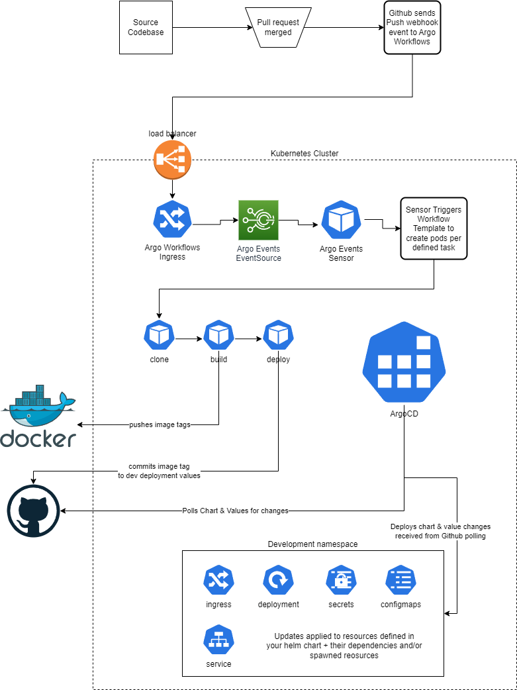

# Argo Workflows CI Chart

This chart contains configurable resources for defining CI and CD flows & processes.  The chart will deploy the following Kubernetes resources:
- ClusterWorkflowTemplate
    - Defines the steps for building and publishing our docker images
- EventSource
    - Defines the type of events we receive and handle as a source
        - eg. Github Inbound Webhook Events
    - Provides interface for configuring authentication to perform webhook creation etc.
- Sesnor
    - Essentially ties the event source and workflow template together
    - Defines the event source that would trigger a sensor to do something
    - Defines the target workflow operation that is kicked off by the specified events

# Prerequisites

1. (optional) Github App
2. Github Machine User or PAT
3. Dockerhub User w/ Push access
4. ArgoCD & Argo Workflows installation

# Deploy Workflows

1. Create Secrets

    ```bash
    # (optional) Prereq:  create github app
    kubectl create secret generic github-app \
        --from-literal=githubAppID="<app_id>" \
        --from-literal=githubAppInstallationID="<installation_id>" \
        --from-literal=githubAppPrivateKey="<private_key>" -n argocd

    # Prereq:  create github machine user and access token
    kubectl create secret generic github-machine-user \
        --from-literal=email="<example_email>" \
    	--from-literal=token="<example_token>" \
    	--from-literal=username="<example_user>" -n argocd

    # Prereq:  dockerhub user and token
    kubectl create secret docker-registry docker-push-user \
    	--docker-username="<example_user>" \
    	--docker-password="<example_password>" -n argocd
    ```


2. Populate `values.yaml`

    Overview of updating our values file:
    - (optional) Target our newly created github app secret
        - `github.githubApp.privateKey.name`
        - `github.githubApp.appID`
        - `github.githubApp.installationID`
    - Target our newly created github machine user secret
        - `github.machineUserToken.name`
    - Configure Github automated commits for CD
        - `github.automateCommits`
        - `github.deploymentRepository`
        - `github.deploymentFolderPath`
    - Target our newly created docker registry secret
        - `docker.secretName`
        - `docker.owner`
    - Specify the hostname for our inbound webhook from Github


3. Deploy

    It is important to install to the same namespace as your Argo installation

    ```bash
    helm upgrade --install argo-workflow-ci ./argo-workflow-ci -n argocd # --set github.automateCommits=true
    ```


# Diagram


